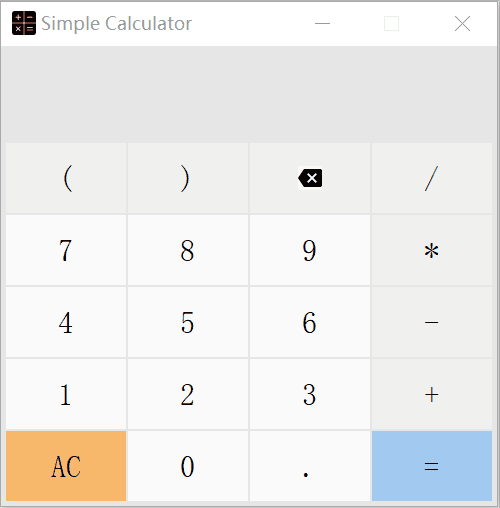

# SimpleCalculator
参考Win10自带计算器的样式实现的简单计算器
## 支持的功能
- 含括号的小数四则运算（暂不支持大数运算）
- 清除表达式、表达式回退
## 使用说明
- 使用键盘输入，或鼠标点击按钮输入
- 如果检测到输入不合法（如“1+）”），运算式不会输出结果，直到用户将其修改为合法的形式
## 运算式处理思路
- 读入所有输入，根据括号匹配和正则表达式判断其是否合法
- 如果合法，则先将运算式转为后缀表达式，再计算结果并输出
## 运行效果

    

